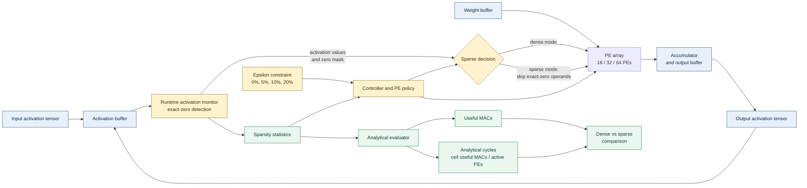

# Runtime Activation Monitoring and Sparse Resource Evaluation for Neural Network Accelerators

## Abstract
This work evaluates exact-zero activation sparsity in CIFAR-compatible ResNet18 and VGG16 models across CIFAR10 and CIFAR100. Using frozen best-validation checkpoints, the study compares dense and exact-zero sparse inference on the complete 10,000-image test sets, measures activation sparsity, computes analytical useful-MAC and cycle reductions, and evaluates an existing PE policy. The four workloads show MAC reductions from 68.28395165353061% to 89.59230678816175%. Dense and sparse predictions agree exactly with zero mismatches in every evaluated case. The policy selects 64 PEs for all workloads at all tested epsilon values. These results are analytical; full-network RTL, physical latency, power, and energy are outside the evidence scope.

## 1. Introduction
Accelerator computation is dominated by repeated operations over intermediate activations. Runtime activation information can expose exact-zero operands and provide a basis for sparse computation analysis. This paper evaluates that idea without claiming physical speedup or energy reduction. Section 2 cites selected verified works; broader literature coverage and any comprehensive novelty claim still require the review documented in `references/REQUIRED_LITERATURE_SEARCH.md`.

## 2. Related Work

### 2.1 CNN Accelerator Architectures
CNN accelerators commonly organize multiply-accumulate units as processing-element (PE) arrays and optimize data movement as well as arithmetic throughput. Eyeriss introduced a reconfigurable spatial architecture and a row-stationary dataflow that seeks to reuse weights, activations, and partial sums across the array [1]. This work motivates evaluating computation at the layer and PE level, but the present study does not implement or claim an Eyeriss-equivalent architecture. Its full-network cycle numbers are analytical estimates based on useful MAC counts and active PE counts.

### 2.2 Sparse Execution and Zero Skipping
Prior accelerators demonstrate that zero-valued operands can be used to avoid ineffectual operations. Cnvlutin identifies zero-valued neuron inputs and skips their associated operations, while SCNN uses compressed sparse representations for both weights and activations to perform sparse convolution [2], [3]. EIE instead targets pruned, compressed networks and exploits weight sparsity during inference [4]. These designs include hardware mechanisms and data representations for sparse execution. Here, the sparse condition is deliberately narrower: only convolution-input activations exactly equal to zero are skipped, with weights and nonzero activations unchanged. Stage 11 validates output equivalence and the sparse scheduler on one deterministic, reduced workload; Stages 12 and 13 measure exact-zero sparsity and useful-MAC counts in four trained CNN/dataset workloads, then estimate cycles analytically. Thus, the full-network results are not a hardware speedup measurement.

### 2.3 Runtime Adaptation and Scope
SamurAI is an adaptive IoT node that combines an event-driven wake-up subsystem with an on-demand processing subsystem that includes embedded ML acceleration [5]. It is relevant as an example of system-level adaptation to workload and energy needs, but it is not an activation-sparsity monitor or a per-layer PE-selection method. In this study, PE selection is evaluated by an analytical latency-constrained policy over 16, 32, and 64 PEs. The policy selects 64 PEs for all four full-network workloads at all tested epsilon values. Consequently, the results support exact-zero computation reduction, but do not demonstrate reduced PE allocation. Stage 11's small RTL experiment and the full-network analytical evaluation also have distinct evidence scopes; neither establishes full-network RTL timing, physical latency, power, or energy.

The contribution is therefore an evidence-oriented evaluation across ResNet18 and VGG16 on CIFAR-10 and CIFAR-100: it reports measured activation sparsity, exact dense/sparse prediction agreement, useful-MAC reduction, analytical cycle estimates, and the neutral outcome of the evaluated PE policy. These results complement prior sparse-accelerator designs but should not be presented as a new sparse hardware architecture or as evidence of a literature-wide research gap.

## 3. Proposed Method

The methodology has two evidence tiers. Stage 11 checks the exact-zero skip mechanism and PE scheduler in RTL on a fixed, reduced convolution workload. Stages 12 and 13 apply the same exact-zero definition to frozen CIFAR-compatible ResNet18 and VGG16 checkpoints and evaluate computation and PE selection across four complete test workloads using software measurements and analytical cycle estimates. The tiers are reported separately: Stage 11 is not a full-network RTL result, and the full-network cycle estimates are not hardware timing.

### 3.1 MAC Reduction Calculation

For a convolution layer, the dense MAC count is

$$
MAC_{dense} = H_{out} W_{out} C_{out} C_{in} K_h K_w.
$$

The sparse evaluator examines every activation operand used by the convolution. An exact-zero activation causes its corresponding multiplication to be skipped, while nonzero activations are processed unchanged. Therefore, the useful MAC count is

$$
MAC_{useful} = \sum_{p \in \mathcal{P}} \mathbf{1}(a_p \ne 0),
$$

where $\mathcal{P}$ is the set of dense convolution operations, $a_p$ is the activation operand for operation $p$, and $\mathbf{1}(a_p \ne 0)$ is 1 for a nonzero activation and 0 for an exact-zero activation. The MAC reduction is then

$$
R_{MAC} =
\left(1 - \frac{MAC_{useful}}{MAC_{dense}}\right) \times 100.
$$

Across layers, the reported value is calculated from the aggregate dense and useful MAC counts rather than from an unweighted average of layer sparsity. This is why activation sparsity and MAC reduction are not necessarily identical: an activation can be reused across multiple output channels and convolution windows. The measured workloads retain 27.7507%, 31.7160%, 10.4077%, and 30.0170% of dense MACs for ResNet18/CIFAR10, ResNet18/CIFAR100, VGG16/CIFAR10, and VGG16/CIFAR100, respectively.

With $PE_{active}$ active processing elements, the analytical sparse cycle estimate is

$$
Cycles_{sparse} =
\left\lceil \frac{MAC_{useful}}{PE_{active}} \right\rceil.
$$

These cycle values estimate computational work under the PE model; they are not measurements of physical hardware latency, power, or energy.

### 3.2 Stage-by-Stage System Concept

The proposed evaluation is organized as the following stages. Each stage produces an output used by the next stage and has a specific purpose in determining whether exact-zero activation information is useful for sparse CNN acceleration.

**Stage 1 - CNN training and checkpoint selection.** ResNet18 and VGG16 are trained on the CIFAR10 and CIFAR100 training split. The checkpoint with the highest validation accuracy is frozen for later evaluation. For $N$ test samples, accuracy is

$$
Accuracy = \frac{\#\{\text{correct predictions}\}}{N}.
$$

This stage is useful because it provides a fixed, reproducible model whose accuracy can be compared before and after sparse execution. The final evaluation uses 45,000 training samples, 5,000 validation samples, and 10,000 test samples with seed 42.

**Stage 2 - Dense baseline inference.** The frozen checkpoint is run normally, without skipping any convolution operation. For each convolution layer $l$, the dense MAC count is

$$
MAC_{dense}^{(l)} = H_{out}^{(l)} W_{out}^{(l)} C_{out}^{(l)} C_{in}^{(l)} K_h^{(l)} K_w^{(l)}.
$$

The total baseline work is $MAC_{dense} = \sum_l MAC_{dense}^{(l)}$. This stage establishes the reference computation and dense prediction vector.

**Stage 3 - Runtime activation monitoring.** During inference, each convolution input activation is tested for an exact zero. The activation sparsity for a monitored tensor is

$$
Sparsity = \frac{Z}{T} \times 100,
$$

where $Z$ is the number of exact-zero activation values and $T$ is the total number of monitored activation values. This stage is useful because it identifies potential work that can be removed without changing weights or nonzero activation values.

**Stage 4 - Exact-zero sparse execution.** For each dense convolution operation $p$, the sparse path applies the mask

$$
m_p = \begin{cases}
0, & a_p = 0,\\
1, & a_p \ne 0.
\end{cases}
$$

The multiplication and accumulation are performed only when $m_p=1$. The useful MAC count is therefore $MAC_{useful}=\sum_p m_p$. This stage is useful because it reduces computational work while preserving the original weights and nonzero values.

**Stage 5 - Dense/sparse prediction verification.** The sparse output is compared with the dense output for every test sample. The prediction mismatch count is

$$
M = \sum_{i=1}^{N} \mathbf{1}(\hat{y}_{dense,i} \ne \hat{y}_{sparse,i}),
$$

and the mismatch rate is $M/N$. This stage is useful because it checks that computation reduction does not change the classification result. In the final four workloads, $M=0$ and dense and sparse test accuracy are identical.

**Stage 6 - MAC reduction measurement.** The skipped work is

$$
MAC_{skipped} = MAC_{dense} - MAC_{useful},
$$

and the aggregate reduction is

$$
R_{MAC} = \frac{MAC_{skipped}}{MAC_{dense}} \times 100.
$$

This stage converts activation observations into a hardware-relevant computation metric. The measured reduction is 72.2493% for ResNet18/CIFAR10, 68.2840% for ResNet18/CIFAR100, 89.5923% for VGG16/CIFAR10, and 69.9830% for VGG16/CIFAR100.

**Stage 7 - PE policy evaluation.** The deterministic analytical policy is evaluated using candidate PE counts $\mathcal{P}_{PE}=\{16,32,64\}$ and epsilon values $\{0\%,5\%,10\%,20\%\}$. For each layer $l$, with useful MAC count $U_l$, the 64-PE reference and allowed cycle count are

$$
C_{64,l}=\left\lceil\frac{U_l}{64}\right\rceil,\qquad
C_{allowed,l}=\left\lceil C_{64,l}(1+\epsilon)\right\rceil.
$$

The policy chooses

$$
PE_l^*=\min\left\{P\in\{16,32,64\}:\left\lceil\frac{U_l}{P}\right\rceil\le C_{allowed,l}\right\},
$$

falling back to 64 if no candidate satisfies the bound. No learned model is used in this Stage 13 policy. PE reduction relative to 64 is

$$
R_{PE}=\left(1-\frac{PE_{selected}}{64}\right)\times100.
$$

In the final results, the policy selects 64 PEs for every workload and epsilon value, so $R_{PE}=0\%$. The measured computation reduction should therefore not be confused with PE-count reduction.

**Stage 8 - Analytical cycle estimation and evidence freeze.** For an active PE count, the cycle estimate is

$$
Cycles = \left\lceil\frac{MAC}{PE_{active}}\right\rceil.
$$

The dense and sparse cycle estimates are compared using

$$
R_{cycles}=\left(1-\frac{Cycles_{sparse}}{Cycles_{dense}}\right)\times100.
$$

This stage summarizes the computational benefit and freezes the tables, figures, and validation results for the paper. The cycle values are analytical estimates only. Earlier Stages 8--11 provide reduced-workload RTL/prototype evidence, while the Stage 13 full-network results remain software and analytical; complete ResNet18/VGG16 RTL timing and physical power or energy are not claimed.

## 4. Accelerator Architecture
The proposed architecture places an activation monitor beside the convolution datapath. The monitor detects exact-zero activation operands and forwards both the activation stream and sparsity statistics to a controller. The controller selects dense or sparse execution and applies the PE policy over the available 16, 32, and 64 PE configurations. Nonzero products are accumulated in the PE array and emitted as the next activation tensor. The evaluation path uses the recorded statistics to calculate useful MACs and analytical cycles; it does not represent measured hardware latency or energy.

Earlier project stages provide reduced-workload RTL/prototype validation. The present full-network results are software and analytical evaluations. Complete ResNet18/VGG16 RTL validation and physical hardware measurements are not claimed.

## 5. Experimental Methodology

### 5.1 Stage 11 RTL Mechanism Check
The RTL check uses one deterministic convolution with an $8\times8\times3$ input, a $3\times3$ kernel, 16 output channels, stride 1, and padding 1. This gives 1,024 outputs and 27,648 dense MACs. The input and weights are generated deterministically and held fixed. A single 64-PE physical array exposes logical active-PE modes of 16, 32, and 64. The sparse scheduler skips a product when its activation operand is exactly zero; it does not alter weights or nonzero operands. The test compares sparse RTL outputs with a dense Python reference and checks useful/skipped MAC counts. For this workload, 18,528 MACs are useful and 9,120 are skipped (32.9861% effective sparsity). The RTL simulation reports 1,158, 579, and 290 sparse cycles for the 16-, 32-, and 64-active-PE modes, respectively, with output and MAC-count checks passing. These are reduced-workload RTL results, not measurements for ResNet18 or VGG16.

### 5.2 Full-Network Evaluation
The full-network matrix contains CIFAR-compatible ResNet18 and VGG16, each evaluated on CIFAR-10 and CIFAR-100. Each dataset uses 45,000 training images, 5,000 validation images, and the complete 10,000-image test set. The split and initialization use seed 42. The best-validation checkpoint for each model/dataset pair is frozen and used for both dense and sparse inference. The PE policy and epsilon values are fixed; test-set layer summaries supply the useful-MAC measurements used to report the policy's per-layer decisions. No learned predictor is trained on the test set.

During inference, convolution input tensors are monitored for exact zeros. The reported input activation sparsity is $Z/T$, where $Z$ and $T$ are the zero and total input elements. To count useful MACs, the convolution input is unfolded according to that layer's kernel, stride, padding, and dilation. Each nonzero unfolded activation operand contributes one useful MAC per output channel. Dense MACs use the convolution's output geometry and channel/kernel dimensions. Counts are accumulated over all test samples and convolution layers before computing aggregate MAC reduction; activation sparsity and MAC reduction are therefore reported as separate quantities.

Dense and sparse inference use the same frozen checkpoint. Sparse execution masks exact-zero convolution inputs only. For each test example, dense and sparse predictions are compared; the evaluation reports mismatch count and dense/sparse accuracy. Full-network RTL execution is not part of this tier.

### 5.3 Resource and Cycle Analysis
The candidate PE counts are 16, 32, and 64. Dense and sparse cycles are estimated as $\lceil MAC/PE\rceil$ using dense and useful MAC totals, respectively. The unchanged deterministic policy is evaluated at epsilon values 0%, 5%, 10%, and 20%, applying the per-layer bound defined in Section 3.2 against the 64-PE sparse-cycle reference. The reported adaptive cycle total is the sum of the selected per-layer analytical estimates. Stage 13 freezes these measurements, policy outputs, and validation artifacts.

All full-network cycle and PE results are analytical. The study does not claim physical latency, full-network RTL timing, FPGA/ASIC implementation, power, or energy measurements.

## 6. Results
- ResNet18 / CIFAR10: test accuracy 0.9513, activation sparsity 62.51186579895019%, MAC reduction 72.24934835338311%, dense/sparse mismatches 0, analytical sparse cycles 24083125525.
- ResNet18 / CIFAR100: test accuracy 0.7697, activation sparsity 57.68464033508301%, MAC reduction 68.28395165353061%, dense/sparse mismatches 0, analytical sparse cycles 27524455397.
- VGG16 / CIFAR10: test accuracy 0.8846, activation sparsity 83.45374636136567%, MAC reduction 89.59230678816175%, dense/sparse mismatches 0, analytical sparse cycles 5093208664.
- VGG16 / CIFAR100: test accuracy 0.6557, activation sparsity 53.85006880540114%, MAC reduction 69.98297529719868%, dense/sparse mismatches 0, analytical sparse cycles 14689419372.

Dense and sparse accuracies agree for all four workloads with zero prediction mismatches. The policy selects 64 PEs for all workloads, so PE-count reduction is not observed under the evaluated constraint.

## 7. Discussion
The results demonstrate substantial analytical computation reduction while preserving predictions. VGG16/CIFAR10 has the highest measured aggregate activation sparsity. Sparse computation reduction and adaptive PE-count reduction should be treated as separate optimization effects.

## 8. Limitations
Analytical cycles are not hardware latency. Full-model RTL, physical FPGA/ASIC timing, physical power, and physical energy were not measured. Accelergy units are not converted into joules. The scope is limited to the four evaluated workloads and exact-zero mechanism.

## 9. Conclusion
Within the evaluated scope, exact-zero sparse execution reduces useful computation and analytical cycles while preserving predictions. The PE policy selected 64 PEs for every final workload. Broader hardware and literature validation remain future work.

## References
[1] Y.-H. Chen, T. Krishna, J. S. Emer, and V. Sze, “Eyeriss: An Energy-Efficient Reconfigurable Accelerator for Deep Convolutional Neural Networks,” *IEEE Journal of Solid-State Circuits*, vol. 52, no. 1, pp. 127–138, 2017. doi: [10.1109/JSSC.2016.2616357](https://doi.org/10.1109/JSSC.2016.2616357).

[2] J. Albericio, P. Judd, T. Hetherington, T. Aamodt, N. Enright Jerger, and A. Moshovos, “Cnvlutin: Ineffectual-Neuron-Free Deep Neural Network Computing,” in *Proceedings of the 43rd Annual International Symposium on Computer Architecture (ISCA)*, 2016, pp. 1–13. doi: [10.1109/ISCA.2016.11](https://doi.org/10.1109/ISCA.2016.11).

[3] A. Parashar et al., “SCNN: An Accelerator for Compressed-Sparse Convolutional Neural Networks,” in *Proceedings of the 44th Annual International Symposium on Computer Architecture (ISCA)*, 2017, pp. 27–40. doi: [10.1145/3079856.3080254](https://doi.org/10.1145/3079856.3080254).

[4] S. Han et al., “EIE: Efficient Inference Engine on Compressed Deep Neural Network,” in *Proceedings of the 43rd Annual International Symposium on Computer Architecture (ISCA)*, 2016, pp. 243–254. doi: [10.1109/ISCA.2016.30](https://doi.org/10.1109/ISCA.2016.30).

[5] I. Miro-Panades et al., “SamurAI: A Versatile IoT Node With Event-Driven Wake-Up and Embedded ML Acceleration,” *IEEE Journal of Solid-State Circuits*, vol. 58, no. 6, pp. 1782–1797, 2023. doi: [10.1109/JSSC.2022.3198505](https://doi.org/10.1109/JSSC.2022.3198505).
